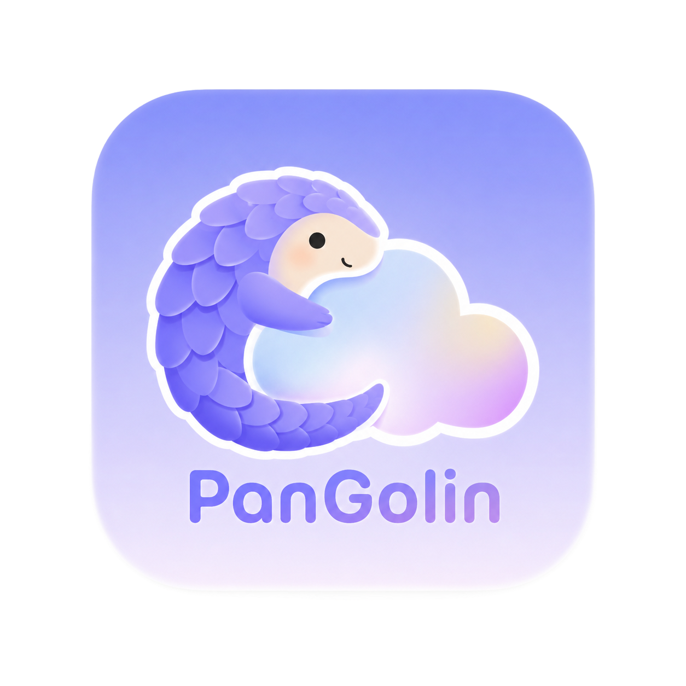

  
  <h1>PanGolin</h1>
  
<b>Make your SJTU cloud disk a local file system.</b>

## Why

 交大云盘（JBox）是一个实用的文件存储平台，但它的网页端操作体验和本地文件系统还有不小的差距。上传下载要开浏览器、批量操作受限于网页交互、文件浏览缺少终端的灵活度——日常用起来总觉得隔了一层。
 
 PanGolin 想做的就是把这层隔阂拆掉。通过终端模拟 + TUI 界面，把 JBox 当成一个本地目录来操作：ls 看文件、cd 切路径、管道组合命令，让云端存储的交互回到命令行该有的样子。
 
## Features

 ### 🔐 扫码登录
 终端内渲染 jAccount 二维码，用微信或 SJTU App 扫码即登录。Session 自动持久化，下次启动免重复登录。
 
 ### 🐚 TUI Shell
 Bubble Tea 构建的交互式终端界面，支持命令输入、滚动输出、信息面板，体验接近本地 shell。
 
 ### 📁 文件列表
 `ls` 命令列出网盘目录，文件夹绿色高亮并排在前面，按字母排序。
 
 ### 🦔 吉祥物
 穿山甲（Pangolin）贯穿设计，每个 prompt 和面板都有它的身影。
 
## Star History

<a href="https://www.star-history.com/?repos=Okabe-Rintarou-0%2FPanGolin&type=date&legend=top-left">
 <picture>
   <source media="(prefers-color-scheme: dark)" srcset="https://api.star-history.com/chart?repos=Okabe-Rintarou-0/PanGolin&type=date&theme=dark&legend=top-left" />
   <source media="(prefers-color-scheme: light)" srcset="https://api.star-history.com/chart?repos=Okabe-Rintarou-0/PanGolin&type=date&legend=top-left" />
   
 </picture>
</a>
 
